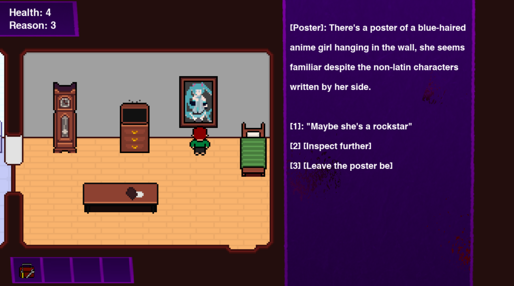
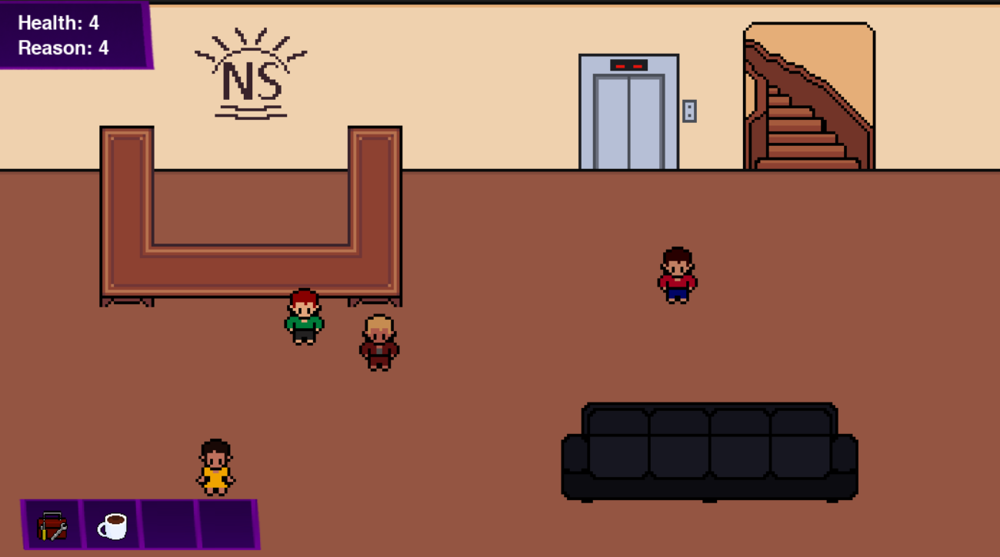

# Newsun

[Relatório](docs/relatorio_A2.pdf)

[Game Design Document](gdd/newsun.md)

## Group:
- [Artur Vidal Krause](https://github.com/arturvidalkrause)
- [Bruno Luís Zerbinatto Rosa](https://github.com/Brunikito)
- [Gustavo de Oliveira da Silva](https://github.com/GuOliv2306)
- [Gustavo Luciano dos Santos](https://github.com/gstavol)
- [Henrique Coelho Beltrão](https://github.com/riqueu)

## About:
Newsun is the final project for our Programming Languages course. You can read our [report](docs/relatorio_A2.pdf) for further information regarding the development of the game, and the [Game Design Document](gdd/newsun.md) to learn more about the concepts of the game.

### Screenshots:




## How to Run

1. Clone the repository:
    ```bash
    git clone https://github.com/riqueu/newsun
    ```
2. Navigate to the project directory:
    ```bash
    cd newsun
    ```
3. Install the required dependencies:
    ```bash
    pip install -r requirements.txt
    ```
4. Run the main script:
    ```bash
    python main.py
    ```
## Running the Tests

To run the unit tests, follow these steps:

1. Ensure you are in the project directory:
    ```bash
    cd newsun
    ```

2. Run the unit tests using the following command:
    ```bash
    python -m unittest discover -s tests
    ```

## License

This project is licensed under the MIT License. See the [LICENSE](LICENSE) file for details.